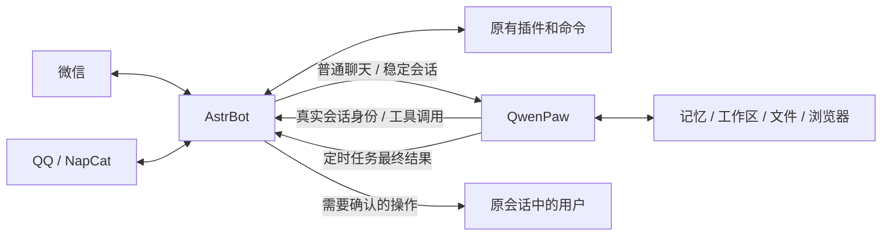

# asrtbot和qwenpaw的结合版

微信 / QQ 里使用 QwenPaw 的记忆与任务能力，同时保留 AstrBot 的平台适配器、插件命令和模型工具。

本项目是两个原项目之间的独立集成层。固定适配 **AstrBot 4.25.1 + QwenPaw 2.2.1**，QQ 通过 **NapCat 4.18.33**。不修改两边的核心源码。



## 首版范围

- AstrBot 原有微信、QQ 接入继续工作；普通文本聊天交给 QwenPaw，同平台、会话和用户保持稳定路由。
- 原有插件命令保留。QwenPaw 能查询和调用显式放行的 AstrBot 模型工具，执行使用原事件及 AstrBot 官方工具执行器。
- QwenPaw 继续管理自己的长期记忆、Skills、文件、浏览器和任务。浏览器功能和模型能力取决于 QwenPaw 的实际配置。
- 定时任务最终文本按保存的路由返回微信 / QQ。需要确认的操作可以在原聊天里同意或拒绝。
- 内网接口鉴权、owner 白名单、会话校验、持久化去重。同一个任务遇到断线只尝试接续，不重复提交原任务。

首版桥接的是**文本**。图片、语音、文件、视频的跨平台转发尚未实现，会明确提示。模型工具只在对应 AstrBot 消息事件仍有效时可调用；定时任务可以使用 QwenPaw 自身工具，但不能借用已过期的 AstrBot 事件。每个第三方插件的具体行为仍需实际验证。

## 开始使用

1. 按 [部署说明](docs/deployment.md) 选择全新部署或已有 AstrBot 追加部署。
2. 按 [QwenPaw 配置](docs/qwenpaw.md) 配置模型、启用本项目的插件和 `astrbot` 回传频道。
3. 按 [QQ 接入说明](docs/qq.md) 配置 NapCat 并扫码登录。微信使用 AstrBot 自身的登录方式。
4. 在微信和 QQ 分别发送 `/paw whoami`，把显示的用户 ID 添加到 `OWNER_USER_IDS`。默认列表为空，任务能力不对陌生人开放。
5. 在原聊天里测试普通对话、重启后记忆、插件命令、工具调用及一条需审核的定时任务。

已有 AstrBot 的追加部署不会自动覆盖现有配置、聊天数据库或网站入口。QQ 扫码、模型密钥和最终联调需由部署者完成。内网运行成功后再按自己的反向代理配置 HTTPS。

## 开发与验证

```sh
python -m pip install -r requirements-dev.txt
python -m unittest discover -s tests -v
bash -n deploy/setup.sh
bash -n deploy/upgrade_existing.sh
```

测试使用本机 HTTP 服务和两边运行时的接口替身，覆盖协议、身份隔离、重放、工具权限、审批与回传；不会登录真实微信 / QQ，不会调用付费模型。真实服务器、官方容器和真实插件的联调结果应另行记录，不能把协议测试视为完整生产验证。

- [接口与架构](docs/architecture.md)
- [项目立项与验收清单](docs/project.md)
- [首版验证记录](docs/validation.md)
- [安全与问题报告](SECURITY.md)
- [第三方项目说明](THIRD_PARTY_NOTICES.md)

本仓库的新集成代码使用 AGPL-3.0-or-later。AstrBot、QwenPaw 与 NapCat 各自遵守原项目许可证。
