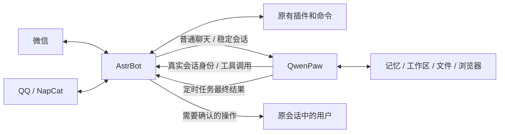

# asrtbot和qwenpaw的结合版

微信 / QQ 里使用 QwenPaw 的记忆与任务能力，同时保留 AstrBot 的平台适配器、插件命令和模型工具。

本项目是两个原项目之间的独立集成层。固定适配 **AstrBot 4.25.1 + QwenPaw 2.2.1**，QQ 通过 **NapCat 4.18.33**。不修改两边的核心源码。

**当前开发改动：个人助手与长期记忆接通。** 普通聊天按用户进入独立 QwenPaw Agent；新增微信 / QQ 主动绑定、私聊 / 群聊记忆分开、手动记忆管理、文件工具范围检查和独立浏览器。参见 [个人助手使用说明](docs/personal-memory.md)。这些代码和自动测试不代表真实模型、QQ / 微信已经完成联调，也尚未更新现有 0.4.1 压缩包或正在运行的正式容器。

**本地组合启动包（0.4.1 开发版）：** Windows 解压后双击 `start.cmd`，一起启动三套程序，成功后只需打开 **http://localhost:18080/**。在同一个入口切换 AstrBot、QwenPaw 和 QQ 登录的原生页面；停止时双击 `stop.cmd`，配置和数据保留。需要已安装 Docker Desktop（Linux 容器）和 Python 3.10+，首次联网拉取官方固定版本镜像，仅构建小型入口服务；QwenPaw 源码构建另有显式选项。不是预装账号或镜像的离线包。详见 [Windows 使用说明](docs/windows.md)。已在 Windows Docker Desktop 实际启动三套原生应用，并验证文件、记忆、任务和 Linux 浏览器；真实账号和模型仍需配置与验收。



## 当前范围

- AstrBot 原有微信、QQ 接入继续工作；普通聊天及附件交给各用户独立的 QwenPaw 助手，路由和身份持久保存。账号绑定后私聊共享个人记忆，群聊仍独立。
- 原有插件命令保留。QwenPaw 能查询和调用显式放行的 AstrBot 模型工具，执行使用原事件及 AstrBot 官方工具执行器。
- QwenPaw 管理原生长期记忆、Skills、文件和任务。个人助手启用自动记忆配置及召回；自动提炼需要模型。手动记忆可在聊天中保存、查看、更正和删除。个人浏览器提供结构化的打开、读取、点击和填写操作。
- 定时任务最终文本按保存的路由返回微信 / QQ，文件可用本项目的发送工具主动回传。需要确认的操作可以在原聊天里同意或拒绝。
- 内网接口鉴权、owner 白名单、会话校验、持久化去重。同一个任务遇到断线只尝试接续，不重复提交原任务。

**复用两端原生后台。** AstrBot 后台管理微信 / QQ、插件和桥接权限；QwenPaw Console 管理模型、记忆、任务、工具与工作区。本项目负责连接消息、会话、附件和工具，不重复实现记忆 / 任务管理页面。0.4.0 的统一入口只承载原生页面导航；两边分别维护配置、登录与数据，服务器模式见[部署说明](docs/deployment.md)。

图片、文件、视频与音频桥接延续 0.2.0。微信出站音频作为文件发送并提示；QQ 使用语音组件。媒体格式能否被模型理解、平台是否接受对应文件，仍取决于实际配置与平台限制。详见[媒体使用说明](docs/media.md)。

AstrBot 模型工具只在对应消息事件仍有效时可调用；定时任务可以使用 QwenPaw 自身工具和本项目的文件发送工具，但不能借用已过期的 AstrBot 事件。每个第三方插件的具体行为仍需实际验证。

## 开始使用

1. Windows 本机体验按 [组合包说明](docs/windows.md) 双击启动；服务器安装或已有 AstrBot 追加部署按 [部署说明](docs/deployment.md) 操作。
2. 按 [QwenPaw 配置](docs/qwenpaw.md) 配置模型、启用本项目的插件和 `astrbot` 回传频道。
3. 按 [QQ 接入说明](docs/qq.md) 配置 NapCat 并扫码登录。微信使用 AstrBot 自身的登录方式。
4. 在微信和 QQ 分别发送 `/paw whoami`，把显示的用户 ID 添加到桥接插件的“允许使用的用户ID”设置，或者非空 `OWNER_USER_IDS`。空环境变量不会覆盖后台设置；默认列表为空。
5. 在 QwenPaw 原生 Console 管理记忆与任务；主动任务选择 `astrbot` 频道和已登记的接收会话，并按配置说明保留工具审批。在原微信 / QQ 聊天里测试普通对话、重启后记忆、插件命令、工具调用及一条需审核的定时任务。

已有 AstrBot 的追加部署不会自动覆盖现有配置、聊天数据库或网站入口。QQ 扫码、模型密钥和最终联调需由部署者完成。内网运行成功后再按自己的反向代理配置 HTTPS。

## 开发与验证

```sh
python -m pip install -r requirements-dev.txt
python -m unittest discover -s tests -v
bash -n deploy/setup.sh
bash -n deploy/upgrade_existing.sh
```

单元和协议测试使用本机 HTTP 服务及运行时接口替身，覆盖身份隔离、重放、工具权限、审批、回传、文件和只读部署诊断。另提供固定官方 AstrBot 核心的真实加载 / 执行验证、完整 QwenPaw 的原生文件 / ReMe 记忆索引与检索 / Cron 执行 / 重启持久性检查，以及真实浏览器 SDK / 工具子进程检查。各层验证的实际结果和边界见[验证记录](docs/validation.md)；不把本地测试模型或回调端点视为真实微信 / QQ、模型或生产环境验收。

- [接口与架构](docs/architecture.md)
- [项目立项与验收清单](docs/project.md)
- [首版验证记录](docs/validation.md)
- [安全与问题报告](SECURITY.md)
- [第三方项目说明](THIRD_PARTY_NOTICES.md)

本仓库的新集成代码使用 AGPL-3.0-or-later。AstrBot、QwenPaw 与 NapCat 各自遵守原项目许可证。
